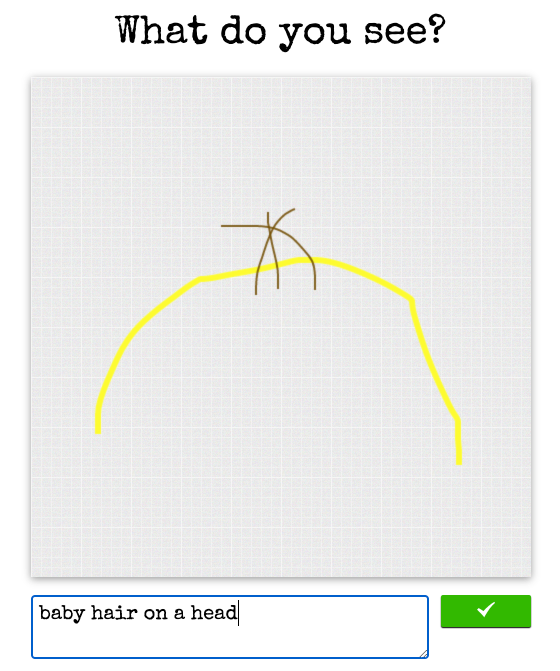

If you don't want to read, here's the [live demo](http://web-telephone.herokuapp.com).
___

Way back in 2014, I collaborated with my friend [Simon](https://github.com/7imon7ays) on a really silly project: building an online game of telephone. We built it and [posted it on Reddit](https://www.reddit.com/r/WebGames/comments/247ctc/the_worlds_biggest_game_of_telephone_ever/), and it took off quickly: we received 100,000 in the first week. Granted, maybe 30% of those were swastikas and penis drawings, but still.

### User experience

When you visited the home page, one of two situations could occur:

1) You'd see a hand-drawn image, and asked to describe what it is in English.

2) You'd see a short phrase, and have to draw your best version of that phrase in a little canvas.

Then, in either case, you'd be taken to a page that would show your submission, then your prompt, then the prompt that the prompt responded to, then that prompt's prompt, etc.

### Dealing with concurrent submissions

What do you do when multiple people respond to the same post? After all, this thing exists on the internet with no auth whatsoever.

#### Choose the earliest? No.
One option would be to just reject all concurrent submissions except the first. Not great if you draw a true masterpiece and then are told "hey sorry we can't use it so it's gone forever." 

The game was called "The World's Biggest Game Of Telephone Ever", and it was important to us to build the longest chain of answers possible. So we really didn't want to throw out users answers.

#### Branching? Yes!
We decided to implement branching. Let's say a prompt receives 3 concurrent submissions. We would make all 3 submissions "public", such that they would go live on the site and could all get responses. But how to choose which of the 3 submissions to show to the next person who visits the homepage? Well, it could have been random, but again, we wanted to make as long of a chain as possible. So we would randomly choose from the three submissions with a bias towards the one that was on the longest branch, ie. had the most parent nodes.

### No "users"

We wanted to keep things really simple and fast, so we didn't do any sort of auth. But we did add some features that I guess you would call "growth hacks" to keep people engaged:

<figure>
    
    <figcaption>We made is very easy to pass in your email, so that you'd receive a notification when somebody responded to your post. Pretty good incentive to give out your email.</figcaption>
</figure>

---

OK, that's it! Here's the [Github repo](https://github.com/7imon7ays/web-telephone).