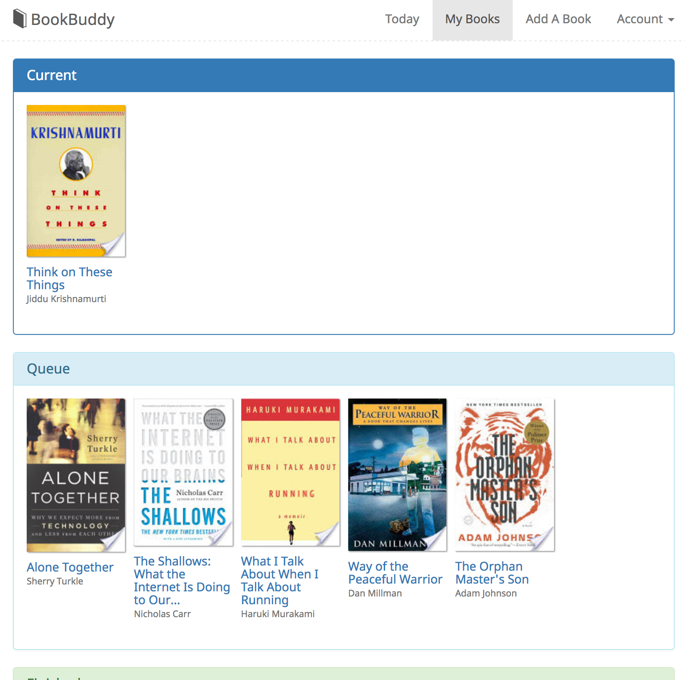

Back in 2017, I made a website called Book Buddy that was a "fitness tracker for reading". A redditor found about out it on [/r/books](https://www.reddit.com/r/books), and we did a little interview together, which you can find [here](https://www.buzzbookstore.com/blog/2017/6/14/a-brief-conversation-with-will-mortiz-creator-of-bookbuddy).

I made this at a time where I was particularly gung-ho about forcing myself to read. Since I've never been a bookworm, treating reading like exercise felt like a good idea.

The app is no longer live, but here are some screenshots that show how it worked:

<figure>
    
    <figcaption>Your "Today" page would show what books you were reading, and a calendar for how many days you read that month.</figcaption>
</figure>

<figure>
    
    <figcaption>You could maintain your library and add books via the Google Books API.</figcaption>
</figure>

<figure>
    
    <figcaption>You could take notes, and be able to consult them later. I like doing after in order to consolidate my thoughts, and have something that I can quickly go back to if I want to reflect on the book.</figcaption>
</figure>

I felt like this app combined things that already existed at the time: a "tracking" interface similar to Github commit history or any habit tracking app, a rich text editor, etc. I left it in a place where I felt like it didn't do any of those things particularly well. At the very least, it sure was prettier and nicer to interact with than Goodreads.

Here are Github links to the [front-end](https://github.com/willthedeveloper/book-buddy) and the [API](https://github.com/willthedeveloper/book-buddy-api).