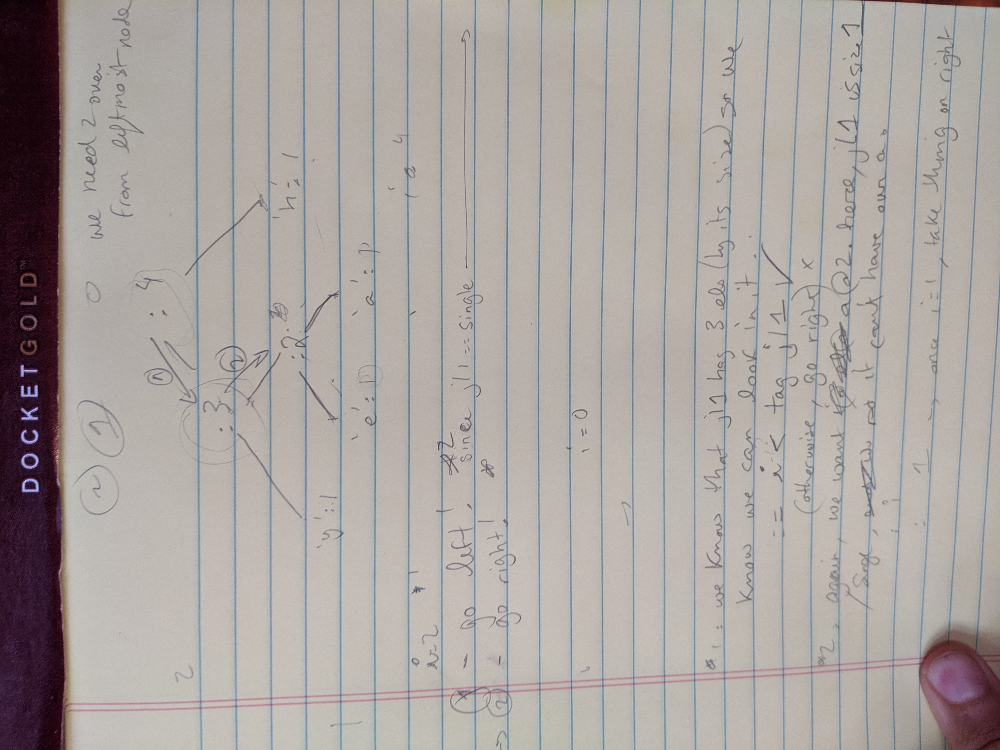

I spent the first 7 weeks of my time stint at [Recurse Center](https://www.recurse.com) learning Haskell. Why would a front end developer spend time learning Haskell? Well:

At first, I wanted to learn Typescript, in order to learn how to use a statically-typed language.

Then, someone at Recurse told me that if I *really* wanted to get good with types, I should try out [Elm](https://elm-lang.org/). So I tabled Typescript and started learning Elm.

Then, someone told me that if I really wanted to learn Elm,  I should learn Haskell. Because Elm is like kindergarten for Haskell. So I tabled Typescript and started learning Haskell.

And so learning Haskell was a breeze and I got bored quickly.

That is a lie. Learning Haskell looked more like this:

After 7 weeks of being stuck-at-the-bottom-of-a-recursive-rabbit-hole, I came out the other side having completed Brent Yorgey's [Introduction to Haskell](https://www.seas.upenn.edu/~cis194/spring13/) course, and it was a true pleasure. I spent a good deal of time with [Learn You A Haskell](http://learnyouahaskell.com/chapters), which is one of the best-written programming books I've ever read. I did my first-ever binary tree traversal, and really beefed up ability to work recursively.

After some encouragment from my RC peers, I gave a short introductory presentation that touches upon how monads give us some needed flexibility when working with a strict type system. Enjoy.

https://www.youtube.com/watch?v=dhGCSBRc1gM

Once again, I gave this presentation for Recurse Center. If you want to do a "writer's retreat for programmers", you should [apply](https://www.recurse.com/apply).

