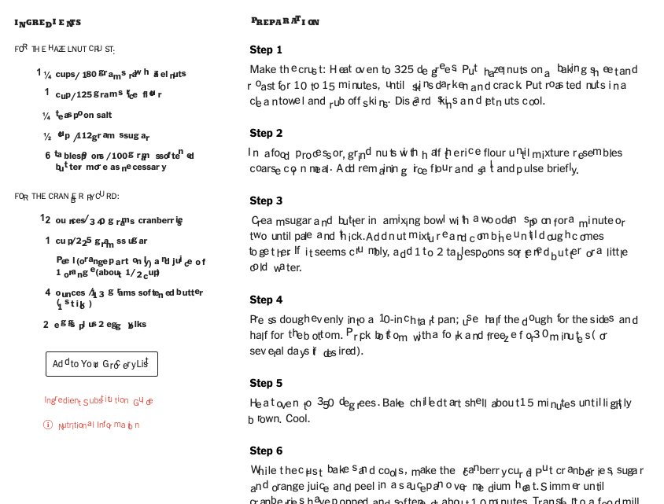

## Tl;dr

Here is the [demo site](https://letter-messer-upper.surge.sh/). Or just click
<a href="javascript:(function()%7B%22use%20strict%22%3B%0A%2F%2F%20WRAPPER%0Afunction%20textFilter(node)%20%7B%0A%20%20%20%20if%20(%5B%0A%20%20%20%20%20%20%20%20'p'%2C%0A%20%20%20%20%20%20%20%20'span'%2C%0A%20%20%20%20%20%20%20%20'label'%2C%0A%20%20%20%20%20%20%20%20'a'%2C%0A%20%20%20%20%20%20%20%20'h1'%2C%0A%20%20%20%20%20%20%20%20'h2'%2C%0A%20%20%20%20%20%20%20%20'h3'%2C%0A%20%20%20%20%20%20%20%20'h4'%2C%0A%20%20%20%20%20%20%20%20'h5'%2C%0A%20%20%20%20%20%20%20%20'h6'%2C%0A%20%20%20%20%20%20%20%20'td'%2C%0A%20%20%20%20%20%20%20%20'li'%2C%0A%20%20%20%20%20%20%20%20'section'%2C%0A%20%20%20%20%20%20%20%20'div'%2C%0A%20%20%20%20%20%20%20%20'input'%2C%0A%20%20%20%20%20%20%20%20'button'%2C%0A%20%20%20%20%20%20%20%20'label'%2C%0A%20%20%20%20%20%20%20%20'b'%2C%0A%20%20%20%20%20%20%20%20'strong'%2C%0A%20%20%20%20%20%20%20%20'em'%2C%0A%20%20%20%20%20%20%20%20'pre'%2C%0A%20%20%20%20%20%20%20%20'footer'%2C%0A%20%20%20%20%20%20%20%20'cite'%2C%0A%20%20%20%20%20%20%20%20'time'%2C%0A%20%20%20%20%20%20%20%20'abbr'%2C%0A%20%20%20%20%20%20%20%20'del'%2C%0A%20%20%20%20%20%20%20%20'sub'%2C%0A%20%20%20%20%20%20%20%20'dd'%2C%0A%20%20%20%20%20%20%20%20'dt'%2C%0A%20%20%20%20%20%20%20%20'legend'%2C%0A%20%20%20%20%20%20%20%20'q'%2C%0A%20%20%20%20%20%20%20%20'mark'%2C%0A%20%20%20%20%20%20%20%20'samp'%2C%0A%20%20%20%20%20%20%20%20'ins'%2C%0A%20%20%20%20%20%20%20%20'var'%2C%0A%20%20%20%20%20%20%20%20'i'%2C%0A%20%20%20%20%20%20%20%20'dfn'%2C%0A%20%20%20%20%20%20%20%20'code'%0A%20%20%20%20%5D.includes(node.parentElement.localName))%20%7B%0A%20%20%20%20%20%20%20%20return%20NodeFilter.FILTER_ACCEPT%3B%0A%20%20%20%20%7D%0A%20%20%20%20else%20%7B%0A%20%20%20%20%20%20%20%20return%20NodeFilter.FILTER_SKIP%3B%0A%20%20%20%20%7D%0A%7D%0Afunction%20getTextNodes()%20%7B%0A%20%20%20%20var%20walk%20%3D%20document.createTreeWalker(document.body%2C%20NodeFilter.SHOW_TEXT%2C%20%7B%20acceptNode%3A%20textFilter%20%7D%2C%20true)%3B%0A%20%20%20%20var%20n%2C%20a%20%3D%20%5B%5D%3B%0A%20%20%20%20while%20((n%20%3D%20walk.nextNode()))%0A%20%20%20%20%20%20%20%20a.push(n)%3B%0A%20%20%20%20return%20a%3B%0A%7D%0Afunction%20shouldWrap(className)%20%7B%0A%20%20%20%20return%20document.getElementsByClassName(className).length%20%3D%3D%3D%200%3B%0A%7D%0Afunction%20wrapCharacters(className)%20%7B%0A%20%20%20%20return%20new%20Promise((resolve%2C%20reject)%20%3D%3E%20%7B%0A%20%20%20%20%20%20%20%20%2F%2F%20Get%20all%20text%20nodes%20in%20DOM%0A%20%20%20%20%20%20%20%20let%20textNodes%20%3D%20getTextNodes()%3B%0A%20%20%20%20%20%20%20%20for%20(let%20textNode%20of%20textNodes)%20%7B%0A%20%20%20%20%20%20%20%20%20%20%20%20%2F%2F%20Split%20node%20up%20into%20individual%20letters%0A%20%20%20%20%20%20%20%20%20%20%20%20let%20text%20%3D%20textNode.textContent%3B%0A%20%20%20%20%20%20%20%20%20%20%20%20let%20textArray%20%3D%20text%3F.split('')%3B%0A%20%20%20%20%20%20%20%20%20%20%20%20%2F%2F%20Generate%20the%20new%20element%20for%20each%20letter.%0A%20%20%20%20%20%20%20%20%20%20%20%20textArray%3F.map((char)%20%3D%3E%20%7B%0A%20%20%20%20%20%20%20%20%20%20%20%20%20%20%20%20const%20elemChar%20%3D%20document.createElement('span')%3B%0A%20%20%20%20%20%20%20%20%20%20%20%20%20%20%20%20const%20isEmptySpace%20%3D%20char%20%3D%3D%3D%20'%20'%20%7C%7C%20char%20%3D%3D%3D%20'%5Cn'%3B%0A%20%20%20%20%20%20%20%20%20%20%20%20%20%20%20%20elemChar.textContent%20%3D%20char%3B%0A%20%20%20%20%20%20%20%20%20%20%20%20%20%20%20%20if%20(!isEmptySpace)%20%7B%0A%20%20%20%20%20%20%20%20%20%20%20%20%20%20%20%20%20%20%20%20elemChar.setAttribute('class'%2C%20className)%3B%0A%20%20%20%20%20%20%20%20%20%20%20%20%20%20%20%20%7D%0A%20%20%20%20%20%20%20%20%20%20%20%20%20%20%20%20textNode.parentNode%3F.insertBefore(elemChar%2C%20textNode)%3B%0A%20%20%20%20%20%20%20%20%20%20%20%20%20%20%20%20return%20elemChar%3B%0A%20%20%20%20%20%20%20%20%20%20%20%20%7D)%3B%0A%20%20%20%20%20%20%20%20%20%20%20%20textNode.parentNode%3F.removeChild(textNode)%3B%0A%20%20%20%20%20%20%20%20%7D%0A%20%20%20%20%20%20%20%20resolve(className)%3B%0A%20%20%20%20%7D)%3B%0A%7D%0Afunction%20deployWrapperFunction(className%2C%20wrapperFunc)%20%7B%0A%20%20%20%20const%20elems%20%3D%20document.getElementsByClassName(className)%3B%0A%20%20%20%20for%20(let%20index%20%3D%200%3B%20index%20%3C%20elems.length%3B%20index%2B%2B)%20%7B%0A%20%20%20%20%20%20%20%20const%20element%20%3D%20elems%5Bindex%5D%3B%0A%20%20%20%20%20%20%20%20wrapperFunc(element)%3B%0A%20%20%20%20%7D%0A%7D%0A%2F%2F%20RANSOMIFY%0Aconst%20hex2Rgb%20%3D%20function%20(hex)%20%7B%0A%20%20%20%20const%20result%20%3D%20%2F%5E%23%3F(%5Ba-f%5Cd%5D%7B2%7D)(%5Ba-f%5Cd%5D%7B2%7D)(%5Ba-f%5Cd%5D%7B2%7D)%24%2Fi.exec(hex)%3B%0A%20%20%20%20return%20result%0A%20%20%20%20%20%20%20%20%3F%20%7B%0A%20%20%20%20%20%20%20%20%20%20%20%20r%3A%20parseInt(result%5B1%5D%2C%2016)%2C%0A%20%20%20%20%20%20%20%20%20%20%20%20g%3A%20parseInt(result%5B2%5D%2C%2016)%2C%0A%20%20%20%20%20%20%20%20%20%20%20%20b%3A%20parseInt(result%5B3%5D%2C%2016)%0A%20%20%20%20%20%20%20%20%7D%0A%20%20%20%20%20%20%20%20%3A%20%7B%20r%3A%200%2C%20g%3A%200%2C%20b%3A%200%20%7D%3B%0A%7D%3B%0Afunction%20luminance(r%2C%20g%2C%20b)%20%7B%0A%20%20%20%20const%20a%20%3D%20%5Br%2C%20g%2C%20b%5D.map(function%20(v)%20%7B%0A%20%20%20%20%20%20%20%20v%20%2F%3D%20255%3B%0A%20%20%20%20%20%20%20%20return%20v%20%3C%3D%200.03928%20%3F%20v%20%2F%2012.92%20%3A%20Math.pow((v%20%2B%200.055)%20%2F%201.055%2C%202.4)%3B%0A%20%20%20%20%7D)%3B%0A%20%20%20%20return%20a%5B0%5D%20*%200.2126%20%2B%20a%5B1%5D%20*%200.7152%20%2B%20a%5B2%5D%20*%200.0722%3B%0A%7D%0Afunction%20contrast(rgb1%2C%20rgb2)%20%7B%0A%20%20%20%20const%20lum1%20%3D%20luminance(rgb1.r%2C%20rgb1.g%2C%20rgb1.b)%3B%0A%20%20%20%20const%20lum2%20%3D%20luminance(rgb2.r%2C%20rgb2.g%2C%20rgb2.b)%3B%0A%20%20%20%20const%20brightest%20%3D%20Math.max(lum1%2C%20lum2)%3B%0A%20%20%20%20const%20darkest%20%3D%20Math.min(lum1%2C%20lum2)%3B%0A%20%20%20%20return%20(brightest%20%2B%200.05)%20%2F%20(darkest%20%2B%200.05)%3B%0A%7D%0Afunction%20setFontColors(elemChar)%20%7B%0A%20%20%20%20let%20fontColor%20%3D%20randomColorGen()%3B%0A%20%20%20%20let%20fontBackgroundColor%20%3D%20randomColorGen()%3B%0A%20%20%20%20while%20(contrast(hex2Rgb(fontColor)%2C%20hex2Rgb(fontBackgroundColor))%20%3C%206)%20%7B%0A%20%20%20%20%20%20%20%20fontColor%20%3D%20randomColorGen()%3B%0A%20%20%20%20%20%20%20%20fontBackgroundColor%20%3D%20randomColorGen()%3B%0A%20%20%20%20%7D%0A%20%20%20%20elemChar.style.setProperty('color'%2C%20fontColor)%3B%0A%20%20%20%20elemChar.style.setProperty('background-color'%2C%20fontBackgroundColor)%3B%0A%7D%0Afunction%20getRandomFromArray(array)%20%7B%0A%20%20%20%20return%20array%5BMath.floor(Math.random()%20*%20array.length)%5D%3B%0A%7D%0Afunction%20randomPixelSizeGen(multiplier%2C%20sizeFloor)%20%7B%0A%20%20%20%20const%20randomNum%20%3D%20Math.floor(Math.random()%20*%20multiplier)%3B%0A%20%20%20%20return%20randomNum%20%3E%20sizeFloor%0A%20%20%20%20%20%20%20%20%3F%20randomNum.toString()%20%2B%20'px'%0A%20%20%20%20%20%20%20%20%3A%20sizeFloor.toString()%20%2B%20'px'%3B%0A%7D%0Afunction%20randomColorGen()%20%7B%0A%20%20%20%20const%20colorArray%20%3D%20%5B%0A%20%20%20%20%20%20%20%20'%23ffaf12'%2C%0A%20%20%20%20%20%20%20%20'%2334558b'%2C%0A%20%20%20%20%20%20%20%20'%234ec5a5'%2C%0A%20%20%20%20%20%20%20%20'%23565d47'%2C%0A%20%20%20%20%20%20%20%20'%23798fa8'%2C%0A%20%20%20%20%20%20%20%20'%23fd823e'%2C%0A%20%20%20%20%20%20%20%20'%23117893'%2C%0A%20%20%20%20%20%20%20%20'%23f0daa4'%2C%0A%20%20%20%20%20%20%20%20'%23eaac9d'%2C%0A%20%20%20%20%20%20%20%20'%23a2553a'%2C%0A%20%20%20%20%20%20%20%20'%2372617d'%2C%0A%20%20%20%20%20%20%20%20'%23b49c73'%2C%0A%20%20%20%20%20%20%20%20'%233b3d4b'%2C%0A%20%20%20%20%20%20%20%20'%23eff0f1'%2C%0A%20%20%20%20%20%20%20%20'%23a09d9c'%0A%20%20%20%20%5D%3B%0A%20%20%20%20return%20getRandomFromArray(colorArray)%3B%0A%7D%0Afunction%20randomFontCapitalizationGen()%20%7B%0A%20%20%20%20return%20Math.round(Math.random())%20%3D%3D%3D%201%20%3F%20'uppercase'%20%3A%20'lowercase'%3B%0A%7D%0Afunction%20randomFontGen()%20%7B%0A%20%20%20%20const%20fonts%20%3D%20%5B%0A%20%20%20%20%20%20%20%20'Agency%20FB'%2C%0A%20%20%20%20%20%20%20%20'Albertina'%2C%0A%20%20%20%20%20%20%20%20'Antiqua'%2C%0A%20%20%20%20%20%20%20%20'Architect'%2C%0A%20%20%20%20%20%20%20%20'Arial'%2C%0A%20%20%20%20%20%20%20%20'BankFuturistic'%2C%0A%20%20%20%20%20%20%20%20'BankGothic'%2C%0A%20%20%20%20%20%20%20%20'Blackletter'%2C%0A%20%20%20%20%20%20%20%20'Blagovest'%2C%0A%20%20%20%20%20%20%20%20'Calibri'%2C%0A%20%20%20%20%20%20%20%20'Comic%20Sans%20MS'%2C%0A%20%20%20%20%20%20%20%20'Consolas'%2C%0A%20%20%20%20%20%20%20%20'Courier'%2C%0A%20%20%20%20%20%20%20%20'Cursive'%2C%0A%20%20%20%20%20%20%20%20'Decorative'%2C%0A%20%20%20%20%20%20%20%20'Fantasy'%2C%0A%20%20%20%20%20%20%20%20'Fraktur'%2C%0A%20%20%20%20%20%20%20%20'Frosty'%2C%0A%20%20%20%20%20%20%20%20'Garamond'%2C%0A%20%20%20%20%20%20%20%20'Georgia'%2C%0A%20%20%20%20%20%20%20%20'Helvetica'%2C%0A%20%20%20%20%20%20%20%20'Impact'%2C%0A%20%20%20%20%20%20%20%20'Minion'%2C%0A%20%20%20%20%20%20%20%20'Modern'%2C%0A%20%20%20%20%20%20%20%20'Monospace'%2C%0A%20%20%20%20%20%20%20%20'Open%20Sans'%2C%0A%20%20%20%20%20%20%20%20'Palatino'%2C%0A%20%20%20%20%20%20%20%20'Perpetua'%2C%0A%20%20%20%20%20%20%20%20'Roman'%2C%0A%20%20%20%20%20%20%20%20'Sans-serif'%2C%0A%20%20%20%20%20%20%20%20'Serif'%2C%0A%20%20%20%20%20%20%20%20'Script'%2C%0A%20%20%20%20%20%20%20%20'Swiss'%2C%0A%20%20%20%20%20%20%20%20'Tahoma'%2C%0A%20%20%20%20%20%20%20%20'Times'%2C%0A%20%20%20%20%20%20%20%20'Times%20New%20Roman'%2C%0A%20%20%20%20%20%20%20%20'Tw%20Cen%20MT'%2C%0A%20%20%20%20%20%20%20%20'Verdana'%0A%20%20%20%20%5D%3B%0A%20%20%20%20return%20getRandomFromArray(fonts)%3B%0A%7D%0Afunction%20randomRotationGen()%20%7B%0A%20%20%20%20return%20%60rotate(%24%7BMath.random()%20*%204%20-%20Math.random()%20*%204%7Ddeg)%60%3B%0A%7D%0Afunction%20ransomify(spanEl)%20%7B%0A%20%20%20%20setFontColors(spanEl)%3B%0A%20%20%20%20spanEl.style.setProperty('font-family'%2C%20randomFontGen())%3B%0A%20%20%20%20spanEl.style.setProperty('text-transform'%2C%20randomFontCapitalizationGen())%3B%0A%20%20%20%20spanEl.style.setProperty('top'%2C%20randomPixelSizeGen(3%2C%201))%3B%0A%20%20%20%20spanEl.style.setProperty('left'%2C%20randomPixelSizeGen(3%2C%201))%3B%0A%20%20%20%20spanEl.style.setProperty('right'%2C%20randomPixelSizeGen(3%2C%201))%3B%0A%20%20%20%20spanEl.style.setProperty('bottom'%2C%20randomPixelSizeGen(3%2C%201))%3B%0A%20%20%20%20spanEl.style.setProperty('font-size'%2C%20randomPixelSizeGen(20%2C%2015))%3B%0A%20%20%20%20spanEl.style.setProperty('transform'%2C%20randomRotationGen())%3B%0A%20%20%20%20spanEl.style.setProperty('display'%2C%20'inline-block')%3B%0A%20%20%20%20spanEl.style.setProperty('padding'%2C%20'0%201px%3B')%3B%0A%20%20%20%20spanEl.style.setProperty('box-shadow'%2C%20'0px%201px%200px%200px%20%230000003')%3B%0A%7D%0Aasync%20function%20ransomifyAll(className)%20%7B%0A%20%20%20%20if%20(shouldWrap(className))%20%7B%0A%20%20%20%20%20%20%20%20await%20wrapCharacters(className)%3B%0A%20%20%20%20%20%20%20%20deployWrapperFunction(className%2C%20ransomify)%3B%0A%20%20%20%20%7D%0A%20%20%20%20else%20%7B%0A%20%20%20%20%20%20%20%20deployWrapperFunction(className%2C%20ransomify)%3B%0A%20%20%20%20%7D%0A%7D%0A%2F%2F%20SLOWLY%20LOSE%20IT%0Afunction%20getRandomDistance()%20%7B%0A%20%20%20%20const%20factor%20%3D%204%3B%0A%20%20%20%20let%20num%20%3D%20Math.random()%20*%20factor%3B%0A%20%20%20%20num%20*%3D%20Math.floor(Math.random()%20*%202)%20%3D%3D%3D%201%20%3F%201%20%3A%20-1%3B%0A%20%20%20%20return%20num%3B%0A%7D%0Afunction%20moveRandomly(el)%20%7B%0A%20%20%20%20const%20directions%20%3D%20%5B'top'%2C%20'left'%5D%3B%0A%20%20%20%20for%20(const%20prop%20of%20directions)%20%7B%0A%20%20%20%20%20%20%20%20const%20pos%20%3D%20el.style%5Bprop%5D%3B%0A%20%20%20%20%20%20%20%20const%20pos_%20%3D%20parseInt(pos.substr(0%2C%20pos.length%20-%202))%20%2B%20getRandomDistance()%3B%0A%20%20%20%20%20%20%20%20el.style.setProperty(prop%2C%20%60%24%7Bpos_%7Dpx%60)%3B%0A%20%20%20%20%7D%0A%7D%0Afunction%20genRandomMoves(className)%20%7B%0A%20%20%20%20const%20elems%20%3D%20document.getElementsByClassName(className)%3B%0A%20%20%20%20window.setInterval(function%20()%20%7B%0A%20%20%20%20%20%20%20%20const%20el%20%3D%20elems%5BMath.floor(Math.random()%20*%20elems.length)%5D%3B%0A%20%20%20%20%20%20%20%20moveRandomly(el)%3B%0A%20%20%20%20%20%20%20%20console.log('Moved%20element')%3B%0A%20%20%20%20%20%20%20%20console.log(el.style.getPropertyValue('top')%20%3D%3D%3D%20'')%3B%0A%20%20%20%20%7D%2C%205)%3B%0A%7D%0Afunction%20slowlyLoseIt(spanEl)%20%7B%0A%20%20%20%20spanEl.style.setProperty('position'%2C%20'relative')%3B%0A%20%20%20%20spanEl.style.setProperty('top'%2C%20'0px')%3B%0A%20%20%20%20spanEl.style.setProperty('left'%2C%20'0px')%3B%0A%7D%0Aasync%20function%20slowlyLoseItAll(className)%20%7B%0A%20%20%20%20if%20(shouldWrap(className))%20%7B%0A%20%20%20%20%20%20%20%20await%20wrapCharacters(className)%3B%0A%20%20%20%20%20%20%20%20deployWrapperFunction(className%2C%20slowlyLoseIt)%3B%0A%20%20%20%20%20%20%20%20genRandomMoves(className)%3B%0A%20%20%20%20%7D%0A%20%20%20%20else%20%7B%0A%20%20%20%20%20%20%20%20deployWrapperFunction(className%2C%20slowlyLoseIt)%3B%0A%20%20%20%20%20%20%20%20genRandomMoves(className)%3B%0A%20%20%20%20%7D%0A%7D%0AslowlyLoseItAll('all-chars')%3B%7D)()%3B">here</a>.

---

## Introduction

While at Recurse Center, [Lucas](https://github.com/lu-cashmoney) and I wanted to learn Typescript. We decided that it would be nice to make a bookmarklet, in order to keep the project simple and small.

At first, we wanted to build a plugin for hand-drawn underline effects, but it turned out that it's hard for CSS pirates to hijack the `text-decoration` property.

Still though, a "bad underlining" library?! It's got legs.

From that idea, I remembered the dumb viral web thing [Font Bomb](https://fontbomb.ilex.ca/), and, inspired, we decided to write a library that could make every letter on a webpage manipulable. The marketing department came up this name:

### [letter-messer-upper.js](https://github.com/willthefirst/letter-messer-upper)

We do the hard work of crawling the DOM and wrapping every element in a `span`. Then, it's up to the developer to decide how to mess up every letter.

For example: haven't you ever wanted to make a webpage look like a ransom letter? Now you can: <a href="javascript:(function()%7B%22use%20strict%22%3B%0A%2F%2F%20WRAPPER%0Afunction%20textFilter(node)%20%7B%0A%20%20%20%20if%20(%5B%0A%20%20%20%20%20%20%20%20'p'%2C%0A%20%20%20%20%20%20%20%20'span'%2C%0A%20%20%20%20%20%20%20%20'label'%2C%0A%20%20%20%20%20%20%20%20'a'%2C%0A%20%20%20%20%20%20%20%20'h1'%2C%0A%20%20%20%20%20%20%20%20'h2'%2C%0A%20%20%20%20%20%20%20%20'h3'%2C%0A%20%20%20%20%20%20%20%20'h4'%2C%0A%20%20%20%20%20%20%20%20'h5'%2C%0A%20%20%20%20%20%20%20%20'h6'%2C%0A%20%20%20%20%20%20%20%20'td'%2C%0A%20%20%20%20%20%20%20%20'li'%2C%0A%20%20%20%20%20%20%20%20'section'%2C%0A%20%20%20%20%20%20%20%20'div'%2C%0A%20%20%20%20%20%20%20%20'input'%2C%0A%20%20%20%20%20%20%20%20'button'%2C%0A%20%20%20%20%20%20%20%20'label'%2C%0A%20%20%20%20%20%20%20%20'b'%2C%0A%20%20%20%20%20%20%20%20'strong'%2C%0A%20%20%20%20%20%20%20%20'em'%2C%0A%20%20%20%20%20%20%20%20'pre'%2C%0A%20%20%20%20%20%20%20%20'footer'%2C%0A%20%20%20%20%20%20%20%20'cite'%2C%0A%20%20%20%20%20%20%20%20'time'%2C%0A%20%20%20%20%20%20%20%20'abbr'%2C%0A%20%20%20%20%20%20%20%20'del'%2C%0A%20%20%20%20%20%20%20%20'sub'%2C%0A%20%20%20%20%20%20%20%20'dd'%2C%0A%20%20%20%20%20%20%20%20'dt'%2C%0A%20%20%20%20%20%20%20%20'legend'%2C%0A%20%20%20%20%20%20%20%20'q'%2C%0A%20%20%20%20%20%20%20%20'mark'%2C%0A%20%20%20%20%20%20%20%20'samp'%2C%0A%20%20%20%20%20%20%20%20'ins'%2C%0A%20%20%20%20%20%20%20%20'var'%2C%0A%20%20%20%20%20%20%20%20'i'%2C%0A%20%20%20%20%20%20%20%20'dfn'%2C%0A%20%20%20%20%20%20%20%20'code'%0A%20%20%20%20%5D.includes(node.parentElement.localName))%20%7B%0A%20%20%20%20%20%20%20%20return%20NodeFilter.FILTER_ACCEPT%3B%0A%20%20%20%20%7D%0A%20%20%20%20else%20%7B%0A%20%20%20%20%20%20%20%20return%20NodeFilter.FILTER_SKIP%3B%0A%20%20%20%20%7D%0A%7D%0Afunction%20getTextNodes()%20%7B%0A%20%20%20%20var%20walk%20%3D%20document.createTreeWalker(document.body%2C%20NodeFilter.SHOW_TEXT%2C%20%7B%20acceptNode%3A%20textFilter%20%7D%2C%20true)%3B%0A%20%20%20%20var%20n%2C%20a%20%3D%20%5B%5D%3B%0A%20%20%20%20while%20((n%20%3D%20walk.nextNode()))%0A%20%20%20%20%20%20%20%20a.push(n)%3B%0A%20%20%20%20return%20a%3B%0A%7D%0Afunction%20shouldWrap(className)%20%7B%0A%20%20%20%20return%20document.getElementsByClassName(className).length%20%3D%3D%3D%200%3B%0A%7D%0Afunction%20wrapCharacters(className)%20%7B%0A%20%20%20%20return%20new%20Promise((resolve%2C%20reject)%20%3D%3E%20%7B%0A%20%20%20%20%20%20%20%20%2F%2F%20Get%20all%20text%20nodes%20in%20DOM%0A%20%20%20%20%20%20%20%20let%20textNodes%20%3D%20getTextNodes()%3B%0A%20%20%20%20%20%20%20%20for%20(let%20textNode%20of%20textNodes)%20%7B%0A%20%20%20%20%20%20%20%20%20%20%20%20%2F%2F%20Split%20node%20up%20into%20individual%20letters%0A%20%20%20%20%20%20%20%20%20%20%20%20let%20text%20%3D%20textNode.textContent%3B%0A%20%20%20%20%20%20%20%20%20%20%20%20let%20textArray%20%3D%20text%3F.split('')%3B%0A%20%20%20%20%20%20%20%20%20%20%20%20%2F%2F%20Generate%20the%20new%20element%20for%20each%20letter.%0A%20%20%20%20%20%20%20%20%20%20%20%20textArray%3F.map((char)%20%3D%3E%20%7B%0A%20%20%20%20%20%20%20%20%20%20%20%20%20%20%20%20const%20elemChar%20%3D%20document.createElement('span')%3B%0A%20%20%20%20%20%20%20%20%20%20%20%20%20%20%20%20const%20isEmptySpace%20%3D%20char%20%3D%3D%3D%20'%20'%20%7C%7C%20char%20%3D%3D%3D%20'%5Cn'%3B%0A%20%20%20%20%20%20%20%20%20%20%20%20%20%20%20%20elemChar.textContent%20%3D%20char%3B%0A%20%20%20%20%20%20%20%20%20%20%20%20%20%20%20%20if%20(!isEmptySpace)%20%7B%0A%20%20%20%20%20%20%20%20%20%20%20%20%20%20%20%20%20%20%20%20elemChar.setAttribute('class'%2C%20className)%3B%0A%20%20%20%20%20%20%20%20%20%20%20%20%20%20%20%20%7D%0A%20%20%20%20%20%20%20%20%20%20%20%20%20%20%20%20textNode.parentNode%3F.insertBefore(elemChar%2C%20textNode)%3B%0A%20%20%20%20%20%20%20%20%20%20%20%20%20%20%20%20return%20elemChar%3B%0A%20%20%20%20%20%20%20%20%20%20%20%20%7D)%3B%0A%20%20%20%20%20%20%20%20%20%20%20%20textNode.parentNode%3F.removeChild(textNode)%3B%0A%20%20%20%20%20%20%20%20%7D%0A%20%20%20%20%20%20%20%20resolve(className)%3B%0A%20%20%20%20%7D)%3B%0A%7D%0Afunction%20deployWrapperFunction(className%2C%20wrapperFunc)%20%7B%0A%20%20%20%20const%20elems%20%3D%20document.getElementsByClassName(className)%3B%0A%20%20%20%20for%20(let%20index%20%3D%200%3B%20index%20%3C%20elems.length%3B%20index%2B%2B)%20%7B%0A%20%20%20%20%20%20%20%20const%20element%20%3D%20elems%5Bindex%5D%3B%0A%20%20%20%20%20%20%20%20wrapperFunc(element)%3B%0A%20%20%20%20%7D%0A%7D%0A%2F%2F%20RANSOMIFY%0Aconst%20hex2Rgb%20%3D%20function%20(hex)%20%7B%0A%20%20%20%20const%20result%20%3D%20%2F%5E%23%3F(%5Ba-f%5Cd%5D%7B2%7D)(%5Ba-f%5Cd%5D%7B2%7D)(%5Ba-f%5Cd%5D%7B2%7D)%24%2Fi.exec(hex)%3B%0A%20%20%20%20return%20result%0A%20%20%20%20%20%20%20%20%3F%20%7B%0A%20%20%20%20%20%20%20%20%20%20%20%20r%3A%20parseInt(result%5B1%5D%2C%2016)%2C%0A%20%20%20%20%20%20%20%20%20%20%20%20g%3A%20parseInt(result%5B2%5D%2C%2016)%2C%0A%20%20%20%20%20%20%20%20%20%20%20%20b%3A%20parseInt(result%5B3%5D%2C%2016)%0A%20%20%20%20%20%20%20%20%7D%0A%20%20%20%20%20%20%20%20%3A%20%7B%20r%3A%200%2C%20g%3A%200%2C%20b%3A%200%20%7D%3B%0A%7D%3B%0Afunction%20luminance(r%2C%20g%2C%20b)%20%7B%0A%20%20%20%20const%20a%20%3D%20%5Br%2C%20g%2C%20b%5D.map(function%20(v)%20%7B%0A%20%20%20%20%20%20%20%20v%20%2F%3D%20255%3B%0A%20%20%20%20%20%20%20%20return%20v%20%3C%3D%200.03928%20%3F%20v%20%2F%2012.92%20%3A%20Math.pow((v%20%2B%200.055)%20%2F%201.055%2C%202.4)%3B%0A%20%20%20%20%7D)%3B%0A%20%20%20%20return%20a%5B0%5D%20*%200.2126%20%2B%20a%5B1%5D%20*%200.7152%20%2B%20a%5B2%5D%20*%200.0722%3B%0A%7D%0Afunction%20contrast(rgb1%2C%20rgb2)%20%7B%0A%20%20%20%20const%20lum1%20%3D%20luminance(rgb1.r%2C%20rgb1.g%2C%20rgb1.b)%3B%0A%20%20%20%20const%20lum2%20%3D%20luminance(rgb2.r%2C%20rgb2.g%2C%20rgb2.b)%3B%0A%20%20%20%20const%20brightest%20%3D%20Math.max(lum1%2C%20lum2)%3B%0A%20%20%20%20const%20darkest%20%3D%20Math.min(lum1%2C%20lum2)%3B%0A%20%20%20%20return%20(brightest%20%2B%200.05)%20%2F%20(darkest%20%2B%200.05)%3B%0A%7D%0Afunction%20setFontColors(elemChar)%20%7B%0A%20%20%20%20let%20fontColor%20%3D%20randomColorGen()%3B%0A%20%20%20%20let%20fontBackgroundColor%20%3D%20randomColorGen()%3B%0A%20%20%20%20while%20(contrast(hex2Rgb(fontColor)%2C%20hex2Rgb(fontBackgroundColor))%20%3C%206)%20%7B%0A%20%20%20%20%20%20%20%20fontColor%20%3D%20randomColorGen()%3B%0A%20%20%20%20%20%20%20%20fontBackgroundColor%20%3D%20randomColorGen()%3B%0A%20%20%20%20%7D%0A%20%20%20%20elemChar.style.setProperty('color'%2C%20fontColor)%3B%0A%20%20%20%20elemChar.style.setProperty('background-color'%2C%20fontBackgroundColor)%3B%0A%7D%0Afunction%20getRandomFromArray(array)%20%7B%0A%20%20%20%20return%20array%5BMath.floor(Math.random()%20*%20array.length)%5D%3B%0A%7D%0Afunction%20randomPixelSizeGen(multiplier%2C%20sizeFloor)%20%7B%0A%20%20%20%20const%20randomNum%20%3D%20Math.floor(Math.random()%20*%20multiplier)%3B%0A%20%20%20%20return%20randomNum%20%3E%20sizeFloor%0A%20%20%20%20%20%20%20%20%3F%20randomNum.toString()%20%2B%20'px'%0A%20%20%20%20%20%20%20%20%3A%20sizeFloor.toString()%20%2B%20'px'%3B%0A%7D%0Afunction%20randomColorGen()%20%7B%0A%20%20%20%20const%20colorArray%20%3D%20%5B%0A%20%20%20%20%20%20%20%20'%23ffaf12'%2C%0A%20%20%20%20%20%20%20%20'%2334558b'%2C%0A%20%20%20%20%20%20%20%20'%234ec5a5'%2C%0A%20%20%20%20%20%20%20%20'%23565d47'%2C%0A%20%20%20%20%20%20%20%20'%23798fa8'%2C%0A%20%20%20%20%20%20%20%20'%23fd823e'%2C%0A%20%20%20%20%20%20%20%20'%23117893'%2C%0A%20%20%20%20%20%20%20%20'%23f0daa4'%2C%0A%20%20%20%20%20%20%20%20'%23eaac9d'%2C%0A%20%20%20%20%20%20%20%20'%23a2553a'%2C%0A%20%20%20%20%20%20%20%20'%2372617d'%2C%0A%20%20%20%20%20%20%20%20'%23b49c73'%2C%0A%20%20%20%20%20%20%20%20'%233b3d4b'%2C%0A%20%20%20%20%20%20%20%20'%23eff0f1'%2C%0A%20%20%20%20%20%20%20%20'%23a09d9c'%0A%20%20%20%20%5D%3B%0A%20%20%20%20return%20getRandomFromArray(colorArray)%3B%0A%7D%0Afunction%20randomFontCapitalizationGen()%20%7B%0A%20%20%20%20return%20Math.round(Math.random())%20%3D%3D%3D%201%20%3F%20'uppercase'%20%3A%20'lowercase'%3B%0A%7D%0Afunction%20randomFontGen()%20%7B%0A%20%20%20%20const%20fonts%20%3D%20%5B%0A%20%20%20%20%20%20%20%20'Agency%20FB'%2C%0A%20%20%20%20%20%20%20%20'Albertina'%2C%0A%20%20%20%20%20%20%20%20'Antiqua'%2C%0A%20%20%20%20%20%20%20%20'Architect'%2C%0A%20%20%20%20%20%20%20%20'Arial'%2C%0A%20%20%20%20%20%20%20%20'BankFuturistic'%2C%0A%20%20%20%20%20%20%20%20'BankGothic'%2C%0A%20%20%20%20%20%20%20%20'Blackletter'%2C%0A%20%20%20%20%20%20%20%20'Blagovest'%2C%0A%20%20%20%20%20%20%20%20'Calibri'%2C%0A%20%20%20%20%20%20%20%20'Comic%20Sans%20MS'%2C%0A%20%20%20%20%20%20%20%20'Consolas'%2C%0A%20%20%20%20%20%20%20%20'Courier'%2C%0A%20%20%20%20%20%20%20%20'Cursive'%2C%0A%20%20%20%20%20%20%20%20'Decorative'%2C%0A%20%20%20%20%20%20%20%20'Fantasy'%2C%0A%20%20%20%20%20%20%20%20'Fraktur'%2C%0A%20%20%20%20%20%20%20%20'Frosty'%2C%0A%20%20%20%20%20%20%20%20'Garamond'%2C%0A%20%20%20%20%20%20%20%20'Georgia'%2C%0A%20%20%20%20%20%20%20%20'Helvetica'%2C%0A%20%20%20%20%20%20%20%20'Impact'%2C%0A%20%20%20%20%20%20%20%20'Minion'%2C%0A%20%20%20%20%20%20%20%20'Modern'%2C%0A%20%20%20%20%20%20%20%20'Monospace'%2C%0A%20%20%20%20%20%20%20%20'Open%20Sans'%2C%0A%20%20%20%20%20%20%20%20'Palatino'%2C%0A%20%20%20%20%20%20%20%20'Perpetua'%2C%0A%20%20%20%20%20%20%20%20'Roman'%2C%0A%20%20%20%20%20%20%20%20'Sans-serif'%2C%0A%20%20%20%20%20%20%20%20'Serif'%2C%0A%20%20%20%20%20%20%20%20'Script'%2C%0A%20%20%20%20%20%20%20%20'Swiss'%2C%0A%20%20%20%20%20%20%20%20'Tahoma'%2C%0A%20%20%20%20%20%20%20%20'Times'%2C%0A%20%20%20%20%20%20%20%20'Times%20New%20Roman'%2C%0A%20%20%20%20%20%20%20%20'Tw%20Cen%20MT'%2C%0A%20%20%20%20%20%20%20%20'Verdana'%0A%20%20%20%20%5D%3B%0A%20%20%20%20return%20getRandomFromArray(fonts)%3B%0A%7D%0Afunction%20randomRotationGen()%20%7B%0A%20%20%20%20return%20%60rotate(%24%7BMath.random()%20*%204%20-%20Math.random()%20*%204%7Ddeg)%60%3B%0A%7D%0Afunction%20ransomify(spanEl)%20%7B%0A%20%20%20%20setFontColors(spanEl)%3B%0A%20%20%20%20spanEl.style.setProperty('font-family'%2C%20randomFontGen())%3B%0A%20%20%20%20spanEl.style.setProperty('text-transform'%2C%20randomFontCapitalizationGen())%3B%0A%20%20%20%20spanEl.style.setProperty('top'%2C%20randomPixelSizeGen(3%2C%201))%3B%0A%20%20%20%20spanEl.style.setProperty('left'%2C%20randomPixelSizeGen(3%2C%201))%3B%0A%20%20%20%20spanEl.style.setProperty('right'%2C%20randomPixelSizeGen(3%2C%201))%3B%0A%20%20%20%20spanEl.style.setProperty('bottom'%2C%20randomPixelSizeGen(3%2C%201))%3B%0A%20%20%20%20spanEl.style.setProperty('font-size'%2C%20randomPixelSizeGen(20%2C%2015))%3B%0A%20%20%20%20spanEl.style.setProperty('transform'%2C%20randomRotationGen())%3B%0A%20%20%20%20spanEl.style.setProperty('display'%2C%20'inline-block')%3B%0A%20%20%20%20spanEl.style.setProperty('padding'%2C%20'0%201px%3B')%3B%0A%20%20%20%20spanEl.style.setProperty('box-shadow'%2C%20'0px%201px%200px%200px%20%230000003')%3B%0A%7D%0Aasync%20function%20ransomifyAll(className)%20%7B%0A%20%20%20%20if%20(shouldWrap(className))%20%7B%0A%20%20%20%20%20%20%20%20await%20wrapCharacters(className)%3B%0A%20%20%20%20%20%20%20%20deployWrapperFunction(className%2C%20ransomify)%3B%0A%20%20%20%20%7D%0A%20%20%20%20else%20%7B%0A%20%20%20%20%20%20%20%20deployWrapperFunction(className%2C%20ransomify)%3B%0A%20%20%20%20%7D%0A%7D%0A%2F%2F%20SLOWLY%20LOSE%20IT%0Afunction%20getRandomDistance()%20%7B%0A%20%20%20%20const%20factor%20%3D%204%3B%0A%20%20%20%20let%20num%20%3D%20Math.random()%20*%20factor%3B%0A%20%20%20%20num%20*%3D%20Math.floor(Math.random()%20*%202)%20%3D%3D%3D%201%20%3F%201%20%3A%20-1%3B%0A%20%20%20%20return%20num%3B%0A%7D%0Afunction%20moveRandomly(el)%20%7B%0A%20%20%20%20const%20directions%20%3D%20%5B'top'%2C%20'left'%5D%3B%0A%20%20%20%20for%20(const%20prop%20of%20directions)%20%7B%0A%20%20%20%20%20%20%20%20const%20pos%20%3D%20el.style%5Bprop%5D%3B%0A%20%20%20%20%20%20%20%20const%20pos_%20%3D%20parseInt(pos.substr(0%2C%20pos.length%20-%202))%20%2B%20getRandomDistance()%3B%0A%20%20%20%20%20%20%20%20el.style.setProperty(prop%2C%20%60%24%7Bpos_%7Dpx%60)%3B%0A%20%20%20%20%7D%0A%7D%0Afunction%20genRandomMoves(className)%20%7B%0A%20%20%20%20const%20elems%20%3D%20document.getElementsByClassName(className)%3B%0A%20%20%20%20window.setInterval(function%20()%20%7B%0A%20%20%20%20%20%20%20%20const%20el%20%3D%20elems%5BMath.floor(Math.random()%20*%20elems.length)%5D%3B%0A%20%20%20%20%20%20%20%20moveRandomly(el)%3B%0A%20%20%20%20%20%20%20%20console.log('Moved%20element')%3B%0A%20%20%20%20%20%20%20%20console.log(el.style.getPropertyValue('top')%20%3D%3D%3D%20'')%3B%0A%20%20%20%20%7D%2C%205)%3B%0A%7D%0Afunction%20slowlyLoseIt(spanEl)%20%7B%0A%20%20%20%20spanEl.style.setProperty('position'%2C%20'relative')%3B%0A%20%20%20%20spanEl.style.setProperty('top'%2C%20'0px')%3B%0A%20%20%20%20spanEl.style.setProperty('left'%2C%20'0px')%3B%0A%7D%0Aasync%20function%20slowlyLoseItAll(className)%20%7B%0A%20%20%20%20if%20(shouldWrap(className))%20%7B%0A%20%20%20%20%20%20%20%20await%20wrapCharacters(className)%3B%0A%20%20%20%20%20%20%20%20deployWrapperFunction(className%2C%20slowlyLoseIt)%3B%0A%20%20%20%20%20%20%20%20genRandomMoves(className)%3B%0A%20%20%20%20%7D%0A%20%20%20%20else%20%7B%0A%20%20%20%20%20%20%20%20deployWrapperFunction(className%2C%20slowlyLoseIt)%3B%0A%20%20%20%20%20%20%20%20genRandomMoves(className)%3B%0A%20%20%20%20%7D%0A%7D%0AransomifyAll('all-chars')%3B%7D)()%3B">
ransomify</a>.

And since these are bookmarklets, you can save them to your bookmarks bar and run them on any site. We usually tested them out against the New York Times website.

The possibilities are endless. I'd love to make it easier to work with, so that a developer can define some behavior and blamo, you've got a new bookmarklet.

## Learnings

Typescript, `createTreeWalker` (which knows how to crawl [the DOM tree](https://developer.mozilla.org/en-US/docs/Web/API/Document/createTreeWalker)), and how hard it is to configure [Gulp](https://gulpjs.com/).

Again, here's the [demo site](https://letter-messer-upper.surge.sh/) and the [Github repo](https://github.com/willthefirst/letter-messer-upper).